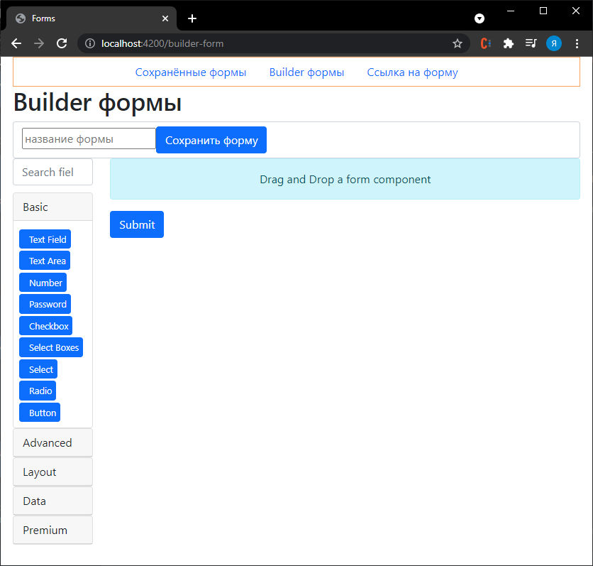

# Forms Angular (v.2)

Проект написан для создания дополнительных полей к основной форме на сайте.

В качестве библиотеки формы был взят `Form.io`

В качестве сервера использовался `Node.js`

В качестве базы данных была `MongoDB`

### cборка проекта:

`npm start` - запуск приложения на 4200 порту

`npm run build` - сборка приложения в dist

`npm run server` - запуск сервера на node.js

`npx angular-cli-ghpages --dir=dist/forms` - публикация приложения на github.io

